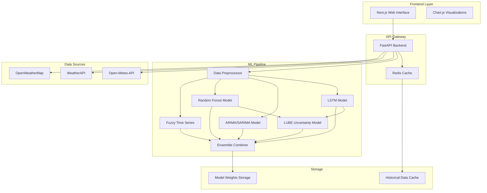

# Design Document

## Overview

The AI Weather Prediction System is a full-stack web application that combines multiple machine learning models to provide accurate 24-hour weather forecasts with uncertainty quantification. The system follows a microservices architecture with a React/Next.js frontend, FastAPI backend, and a sophisticated ML pipeline that processes real-time weather data through five different forecasting models.

## Architecture

### High-Level Architecture



### Technology Stack Selection

**Frontend: Next.js 14 with App Router**
- Justification: Provides both SSR and client-side capabilities, excellent for SEO and performance
- Built-in API routes eliminate need for separate backend for simple operations
- Excellent TypeScript support and developer experience

**Backend: FastAPI (Python)**
- Justification: Optimal for ML model serving with automatic API documentation
- Async support for handling multiple weather API calls
- Native Pydantic integration for data validation
- Easy integration with Python ML libraries

**ML Framework: PyTorch + Scikit-learn + Statsmodels**
- PyTorch: Best for LSTM and LUBE neural networks with dynamic computation graphs
- Scikit-learn: Robust Random Forest implementation with excellent preprocessing tools
- Statsmodels: Industry-standard ARIMA/SARIMA implementation

**Database: SQLite + Redis**
- SQLite: Local storage for model weights and configuration (no server required)
- Redis: In-memory caching for API responses and recent predictions

**Deployment:**
- Frontend: Vercel (free tier, excellent Next.js integration)
- Backend: Railway (free tier, easy Python deployment)

## Components and Interfaces

### Frontend Components

#### 1. Location Selector Component
```typescript
interface LocationSelectorProps {
  onLocationSelect: (location: Location) => void;
  enableGPS: boolean;
}

interface Location {
  name: string;
  latitude: number;
  longitude: number;
  country: string;
}
```

#### 2. Weather Dashboard Component
```typescript
interface WeatherDashboardProps {
  currentWeather: CurrentWeather;
  predictions: PredictionResult[];
  isLoading: boolean;
}

interface PredictionResult {
  timestamp: string;
  temperature: number;
  humidity: number;
  pressure: number;
  windSpeed: number;
  uncertainty: UncertaintyBounds;
  modelContributions: ModelPredictions;
}
```

#### 3. Forecast Chart Component
```typescript
interface ForecastChartProps {
  data: PredictionResult[];
  parameter: WeatherParameter;
  showUncertainty: boolean;
}
```

### Backend API Endpoints

#### 1. Weather Data Endpoint
```python
@app.get("/api/weather/current")
async def get_current_weather(lat: float, lon: float) -> CurrentWeatherResponse

@app.post("/api/weather/predict")
async def predict_weather(request: PredictionRequest) -> PredictionResponse
```

#### 2. Model Management Endpoint
```python
@app.get("/api/models/status")
async def get_model_status() -> ModelStatusResponse

@app.post("/api/models/retrain")
async def retrain_models(model_type: str) -> RetrainResponse
```

### ML Pipeline Interfaces

#### 1. Base Model Interface
```python
class WeatherModel(ABC):
    @abstractmethod
    def train(self, data: pd.DataFrame) -> None
    
    @abstractmethod
    def predict(self, features: np.ndarray) -> np.ndarray
    
    @abstractmethod
    def get_model_info(self) -> ModelInfo
```

#### 2. Ensemble Combiner
```python
class EnsembleCombiner:
    def __init__(self, models: List[WeatherModel], weights: Optional[List[float]] = None)
    
    def combine_predictions(self, predictions: Dict[str, np.ndarray]) -> np.ndarray
    
    def calculate_confidence(self, predictions: Dict[str, np.ndarray]) -> float
```

## Data Models

### Weather Data Schema
```python
class WeatherData(BaseModel):
    timestamp: datetime
    temperature: float  # Celsius
    humidity: float     # Percentage
    pressure: float     # hPa
    wind_speed: float   # m/s
    wind_direction: float  # degrees
    cloud_cover: float  # Percentage
    precipitation: Optional[float]  # mm
    location: Location

class HistoricalWeatherData(BaseModel):
    location: Location
    data_points: List[WeatherData]
    collection_period: DateRange
```

### Prediction Schema
```python
class PredictionPoint(BaseModel):
    timestamp: datetime
    parameter: str
    value: float
    lower_bound: float
    upper_bound: float
    confidence: float
    model_contributions: Dict[str, float]

class PredictionResponse(BaseModel):
    location: Location
    prediction_time: datetime
    forecast_horizon: int  # hours
    predictions: List[PredictionPoint]
    model_performance: Dict[str, ModelMetrics]
```

### Model Configuration Schema
```python
class ModelConfig(BaseModel):
    model_type: str
    hyperparameters: Dict[str, Any]
    training_window: int  # days
    feature_columns: List[str]
    target_columns: List[str]
    
class LSTMConfig(ModelConfig):
    sequence_length: int = 168  # 7 days of hourly data
    hidden_size: int = 64
    num_layers: int = 2
    dropout: float = 0.2
```

## Error Handling

### API Error Handling Strategy

#### 1. Weather API Failures
```python
class WeatherAPIManager:
    def __init__(self):
        self.apis = [OpenMeteoAPI(), WeatherAPI(), OpenWeatherMapAPI()]
        self.current_api_index = 0
    
    async def fetch_weather_data(self, location: Location) -> WeatherData:
        for api in self.apis:
            try:
                return await api.get_weather(location)
            except APIException as e:
                logger.warning(f"API {api.name} failed: {e}")
                continue
        raise AllAPIsFailedException("All weather APIs are unavailable")
```

#### 2. Model Prediction Failures
```python
class RobustPredictor:
    def __init__(self, models: List[WeatherModel]):
        self.models = models
        self.fallback_model = SimpleLinearModel()
    
    def predict(self, features: np.ndarray) -> PredictionResult:
        successful_predictions = {}
        
        for model in self.models:
            try:
                prediction = model.predict(features)
                successful_predictions[model.name] = prediction
            except ModelException as e:
                logger.error(f"Model {model.name} failed: {e}")
        
        if not successful_predictions:
            return self.fallback_model.predict(features)
        
        return self.ensemble_combiner.combine(successful_predictions)
```

#### 3. Frontend Error Boundaries
```typescript
class WeatherErrorBoundary extends React.Component {
  constructor(props) {
    super(props);
    this.state = { hasError: false, errorType: null };
  }

  static getDerivedStateFromError(error) {
    return { 
      hasError: true, 
      errorType: error.name 
    };
  }

  render() {
    if (this.state.hasError) {
      return <ErrorFallback errorType={this.state.errorType} />;
    }
    return this.props.children;
  }
}
```

## Testing Strategy

### 1. Unit Testing
- **ML Models**: Test each model's training and prediction methods with synthetic data
- **API Endpoints**: Test all FastAPI endpoints with mock data
- **Frontend Components**: Jest + React Testing Library for component behavior
- **Data Processing**: Test preprocessing pipelines with edge cases

### 2. Integration Testing
- **API Integration**: Test weather API fallback mechanisms
- **Model Pipeline**: End-to-end testing of data flow through ML pipeline
- **Frontend-Backend**: Test API communication and error handling

### 3. Performance Testing
- **Model Inference Speed**: Ensure predictions complete within 5 seconds
- **API Response Times**: Target <2 seconds for weather data retrieval
- **Frontend Loading**: Measure and optimize bundle size and render times

### 4. Model Validation
- **Backtesting**: Validate models against historical weather data
- **Cross-validation**: Time-series split validation for temporal data
- **Uncertainty Calibration**: Verify LUBE bounds contain actual values at specified confidence levels

### Testing Implementation Plan
```python
# Model Testing Framework
class ModelTestSuite:
    def test_model_accuracy(self, model: WeatherModel, test_data: pd.DataFrame):
        predictions = model.predict(test_data.features)
        mae = mean_absolute_error(test_data.targets, predictions)
        assert mae < self.accuracy_threshold
    
    def test_model_robustness(self, model: WeatherModel):
        # Test with missing data, outliers, etc.
        pass
    
    def test_prediction_speed(self, model: WeatherModel):
        start_time = time.time()
        model.predict(self.sample_features)
        inference_time = time.time() - start_time
        assert inference_time < 1.0  # 1 second max
```

## Performance Optimization

### 1. Caching Strategy
- **API Responses**: Cache weather data for 15 minutes
- **Model Predictions**: Cache predictions for 1 hour per location
- **Static Assets**: CDN caching for frontend resources

### 2. Model Optimization
- **Model Quantization**: Reduce model size for faster inference
- **Batch Prediction**: Process multiple locations simultaneously
- **Lazy Loading**: Load models only when needed

### 3. Database Optimization
- **Indexing**: Index location coordinates and timestamps
- **Data Partitioning**: Partition historical data by date ranges
- **Connection Pooling**: Optimize database connections

This design provides a robust, scalable foundation for the AI weather prediction system while maintaining simplicity for deployment and maintenance.